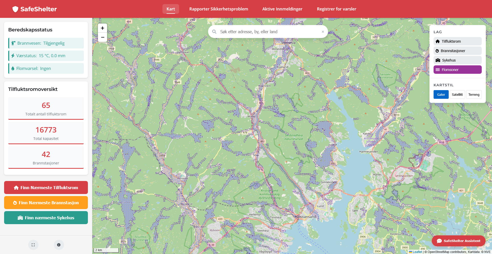

# SafeShelter - Gruppe 6

## Gruppemedlemmer:
- Sigurd Munk Brekke - sigurdmb@uia.no
- Daniel Davik Møgster - danieldm@uia.no
- Ole Bjørk Olsen - olebo@uia.no
- Emil Stokken Kaasa - emilsk@uia.no
- Sigurd Bøthun Mæland - sigurd.b.maland@uia.no
- Henrik Sæverud Lorentzen - henriksl@uia.no

## Prosjektbeskrivelse
Et interaktivt kartprosjekt for å lokalisere tilfluktsrom, brannstasjoner og utsatte flomområder i krisesituasjoner som ved brann eller flom.

---

## **Innholdsfortegnelse**

- [Oversikt og problemstilling](#oversikt-og-problemstilling)
- [Teknologivalg og Arkitektur](#teknologivalg-og-arkitektur)
- [Datakilder](#datakilder)
- [Backend/API-Implementasjon](#backendapi-implementasjon)
- [Frontend og Visualisering](#frontend-og-visualisering)
- [Hovedfunksjoner](#hovedfunksjoner)
- [Installasjon og Oppsett](#installasjon-og-oppsett)
- [Tekniske detaljer](#tekniske-detaljer)
- [Fremtidige Forbedringer](#fremtidige-forbedringer)

---

## **Oversikt og problemstilling**
Ved ekstreme værhendelser som storm og flom er det avgjørende at innbyggere raskt kan finne trygge tilfluktsrom og nødvendige nødetater. Kartløsninger med sanntidsdata kan spille en kritisk rolle i beredskapsarbeid ved å gi oppdatert informasjon om nærmeste tilfluktsrom, brannstasjoner og flomutsatte soner.

I Norge har flere områder varierende tilgang til offentlige tilfluktsrom, og i en nødsituasjon kan avstanden til nærmeste sikre sted være avgjørende for liv og helse. Derfor er det viktig å utvikle verktøy som kombinerer sanntidsposisjon, geodata og interaktive kartlag for å gi brukeren rask og presis informasjon om tryggeste rute til nærmeste ressurs - noe som leder til spørsmålet: 

Hvordan kan et geografisk informasjonssystem bruke sanntidsposisjon til å hjelpe brukeren med å finne nærmeste tilfluktsrom og brannstasjon, samt visualisere flomutsatte soner, slik at man raskt kan ta informerte beslutninger i kritiske situasjoner?

---

## **Teknologivalg og Arkitektur**

- **Frontend:** 
  - Leaflet.js for kartvisualisering
  - HTML/CSS og JavaScript for brukergrensesnitt
  - OSRM (Open Source Routing Machine) for ruteberegninger
  - FontAwesome for kartmarkører og UI-ikoner
  - Leaflet WMS for håndtering av WMS-lag (NVE flomsoner)
  - Leaflet.markercluster for clustering av markører
  
- **Backend:** 
  - Node.js med Express.js for API-endepunkter
  - Supabase (PostgreSQL + PostGIS) for database og geospatiale spørringer
  
- **Databehandling:** 
  - QGIS for geospatial analyse og filkonvertering
  - Python-skript for rengjøring og transformasjon av datasett
  - Proj4js for koordinattransformasjoner i nettleseren
  - PostgreSQL (psql) + PostGIS for import, lagring og spørringer på geodata
  
- **Datakilder:** 
  - GeoNorge
  - NVE (Norges vassdrags- og energidirektorat) via WMS
  - OpenStreetMap (OSM) for basiskart og POI-data

---

## **Datakilder**

- **Datasett (alle filene er lagret i PostGIS-format i Supabase):**
    - [Brannstasjoner](https://kartkatalog.geonorge.no/metadata/brannstasjoner/0ccce81d-a72e-46ca-8bd9-57b362376485?search=Brannstasjoner)
    - [TilfluktsromOffentlige](https://kartkatalog.geonorge.no/metadata/tilfluktsrom-offentlige/dbae9aae-10e7-4b75-8d67-7f0e8828f3d8?search=Tilfluk)
 
    - [Flomsoner](https://kartkatalog.geonorge.no/metadata/flomsoner/e95008fc-0945-4d66-8bc9-e50ab3f50401) (WMS, NVE)

---

## **Backend/API-Implementasjon**

Backend-en er implementert ved hjelp av Supabase som database, som gir enkel tilgang til tabeller og data. Express.js brukes for å håndtere API-forespørsler og fungere som en mellomtjeneste mellom frontend og Supabase.

### **Viktige API-endepunkter:**

| Endepunkt                   | Metode | Beskrivelse                           |
| --------------------------- | ------ | ------------------------------------- |
| `/api/tilfluktsrom_agder`   | GET    | Henter tilfluktsromdata fra Supabase  |
| `/api/brannstasjoner_agder` | GET    | Henter brannstasjonsdata fra Supabase |

---

## **Frontend og Visualisering**

Frontend bruker Leaflet.js for interaktive kartvisualiseringer og HTML/CSS/JavaScript for grensesnitt og interaktivitet. Vi har implementert flere lag som kan aktiveres/deaktiveres, og et responsivt design som fungerer på tvers av enheter.

### **Visuelle funksjoner:**

- Dynamiske markører for tilfluktsrom og brannstasjoner
- Flere kartlag (gater, satellitt og terreng)
- Flomsoner via WMS-lag fra NVE
- Interaktive popups med informasjon
- Animerte rutevisualiseringer
- Markørklynger for bedre ytelse med mange datapunkter
- Applikasjonsomvisning
- Mørk modus for nattbruk

---

## **Hovedfunksjoner**

### **1. Finn nærmeste tilfluktsrom**
- Brukerens posisjon hentes via nettleserens geolokalisering
- Avstand beregnes til alle tilfluktsrom i databasen
- Nærmeste tilfluktsrom identifiseres
- Faktisk kjørerute beregnes ved hjelp av OSRM API
- Ruten vises på kartet med distanse og estimert kjøretid

### **2. Finn nærmeste brannstasjon**
- Brukerens posisjon hentes via nettleserens geolokalisering
- Avstand beregnes til alle brannstasjoner i databasen
- Nærmeste brannstasjon identifiseres
- Faktisk kjørerute beregnes ved hjelp av OSRM API
- Ruten vises på kartet med distanse og estimert kjøretid
- Knapp for å finne nærmeste brannstasjon i brukergrensesnittet

### **3. Visning av flomsoner**
- Data hentes fra NVE WMS-tjeneste og vises dynamisk på kartet
- Brukeren kan aktivere/deaktivere flomsoner med en knapp
- Laget blir værende aktivt selv ved zooming ut/in for bedre oversikt
- Kartet gir informasjon om flomutsatte områder i sanntid

### **4. Kartsøk**
- Adressesøk med autofullføring
- Resultater vises på kartet
- Koordinattransformasjon fra ulike projeksjoner til WGS84

### **5. Informasjonspanel**
- Detaljert informasjon om valgte tilfluktsrom eller brannstasjoner
- Kapasitetsdata for tilfluktsrom
- Kontaktinformasjon for brannstasjoner
- Varsler om flomfare basert på kartlagene
- Interaktiv veiledning som hjelper nye brukere med å forstå funksjonalitetene i systemet

### **6. Karttilpasninger**
- Bytte mellom ulike kartlag (gater, satellitt, terreng)
- Aktivere/deaktivere markørlag (tilfluktsrom, brannstasjoner, flomsoner)
- Fullskjermsmodus
- Logo-klikk for rask tilbakestilling av kartet

---


## **Installasjon og Oppsett**

1. **Forutsetninger:**
   ```
   npm version 6.x eller nyere
   Node.js version 14.x eller nyere
   ```

2. **Installer avhengigheter:**
   ```bash
   npm install
   ```

3. **Konfigurer miljøvariabler:**
   Opprett en .env-fil i rotmappen med følgende innhold:
   ```
   SUPABASE_URL=https://din-supabase-url.supabase.co
   SUPABASE_KEY=din-supabase-nøkkel
   ```

4. **Start serveren:**
   ```bash
   node server.js
   ```

5. **Åpne applikasjonen:**
   Åpne index.html i en nettleser eller bruk en lokal server som Live Server i VS Code.

---

## **Tekniske detaljer**

### Kodestruktur:
- mapoverlay.js: Håndterer kartgrensesnitt og interaktivitet
- script.js: Hovedlogikk for datahåndtering og kartvisualisering
- ui.js: Brukergrensesnitt-kontrollfunksjoner
- style.css: Stilmaler for applikasjonen
- index.html: Hovedstruktur for applikasjonen
- server.js: Backend API-endepunkter

### Ruteberegning:
- `getRoadDistanceAndRoute()` i mapoverlay.js bruker OSRM API for å beregne faktiske kjøreruter
- Fallback til luftlinjeavstand hvis OSRM ikke er tilgjengelig

---

## **Fremtidige Forbedringer**

### **Planlagte oppdateringer:**
- Støtte for alternative transportmetoder (gange, kollektivtransport)
- Offline-modus med lokal datalagring for bruk i nødsituasjoner
- Forbedret håndtering av store datasett med avanserte klyngeteknikker
- Forbedret mobilresponsivitet for bruk i felt under nødsituasjoner
- Utvidede tilgjengelighetsalternativer for brukere med ulike behov

### **Utvidelse av datasett:**
- Integrering av sanntidsdata for pågående krisehendelser
- Historiske data for tidligere nødsituasjoner for bedre risikopredikering
- Tilleggsdata om tilfluktsrom som fasiliteter og begrensninger

### **Tekniske forbedringer:**
- Optimaliseringsarbeid for raskere lasting av kart og data
- Implementasjon for live-oppdateringer
- Forbedring av rutealgoritmer med flere faktorer (trafikk, veiarbeid)

---

## **En Rask Oversikt Over Applikasjonen**

#### **Hovedgrensesnitt for SafeShelter** ####
Applikasjonen tilbyr et intuitivt grensesnitt med informasjon om tilfluktsrom, brannstasjoner og utsatte flomsoner. Sidepanelet viser statusindikator, detaljert informasjon om tilfluktsrom, og nøkkelstatistikk. Det interaktive kartet viser plasseringen av tilfluktsrom (røde markører) og brannstasjoner (oransje markører), med lett tilgang til funksjoner for å finne nærmeste tilfluktsrom og/eller brannstasjon, samt en mer detaljert veibeskrivelse av valgt destinasjon på kartet gjennom Google Maps.
<details>
  <summary>📍 Klikk for å vise hovedgrensesnittet</summary>

  

</details>
<br></br>

**Omvisningsfunksjon**

Gjennom omvisningsfunksjonen kan nye brukere få en guidet omvisning av applikasjonens funksjoner. Omvisningen fremhever nøkkelelementer med en pulserende gul ramme, og gir trinnvis instruksjon om hvordan systemet brukes effektivt i nødsituasjoner. Brukere kan navigere gjennom hvert trinn eller hoppe over omvisningen helt.
<details>
  <summary>📍 Klikk for å vise omvisningen</summary>

  
  

</details>
<br></br>

**Informasjonspanel for tilfluktsrom og brannstasjoner**

Når en brannstasjon velges på kartet, vises detaljert informasjon i sidepanelet. Dette inkluderer stasjonens avdeling, stasjonstype, og kontaktinformasjon for nødstilfeller.
<details>
  <summary>📍 Klikk for å vise brannstasjonens informasjonsvisning</summary>

  
  
</details>

Velger man et tilfluktsrom vises kritisk informasjon som plassering, total kapasitet og tilgangsinstruksjoner. Sikkerhetsmerknadene gir ytterligere veiledning for nødsituasjoner.

<details>
  <summary>📍 Klikk for å vise tilfluktsromsinformasjon</summary>

  

</details>
<br></br>

#### **Søkefunksjonalitet**

Den smarte søkefunksjonen tilbyr adresseforslag mens du skriver, noe som gjør det enkelt å raskt finne spesifikke steder eller områder.
Etter å ha valgt et søkeresultat, sentreres kartet på plasseringen og viser en markør. Brukere kan deretter finne nærliggende tilfluktsrom eller utforske nærområdet.
<details>
  <summary>📍 Klikk for å vise søkefunksjonen</summary>

  
  

</details>
<br></br>

#### **Kartlag og visninger**

Satellittkartet gir detaljerte luftbilder, nyttig for å identifisere landemerker og navigere i områder hvor gatekart kan være utilstrekkelige.
<details>
  <summary>📍 Klikk for å vise satellittkart</summary>

  

</details>

Terrengvisningen fremhever topografiske elementer, som kan være særlig verdifullt ved vurdering av flomrisiko eller planlegging av evakueringsruter i fjellrike områder.

<details>
  <summary>📍 Klikk for å vise terrengkart</summary>

  

</details>
<br></br>

#### **Finn nærmeste tilfluktsrom eller brannstasjon**

Brukere kan bruke ruteguide "Finn Nærmeste Tilfluktsrom" eller "Finn Nærmeste Brannstasjon" for å finne nærmeste tilfluktsrom eller brannstasjon ved bruk av GPS. SafeShelter tar i bruk din nåværende posisjon, identifiserer det nærmeste beredskapsfasilitet før den beregner den optimale ruten. Systemet viser avstand og estimert reisetid for å hjelpe deg å nå tryggheten raskt.

<details>
  <summary>📍 Klikk for å vise GPS-funksjonen for tilfluktsrom</summary>

  
  

</details>
<br></br>

#### **Flomsoner i Ulike Kartlag**

Brukere kan visualisere flomutsatte områder gjennom et dedikert flomsonelag, som kan aktiveres eller deaktiveres etter behov. Laget er integrert med NVE sin WMS-tjeneste og vises sømløst over de forskjellige karttypene. Ved å kombinere flomdata med gatekart, satellittbilder og terrengkart kan brukerne få en mer nyansert forståelse av risikoen i ulike områder. Dette hjelper både innbyggere og nødetater med å identifisere trygge evakueringsruter i tilfelle flom.

<details>
  <summary>📍 Klikk her for å vise flomsoner i forskjellige kartlag</summary>

  
  
  

</details>

