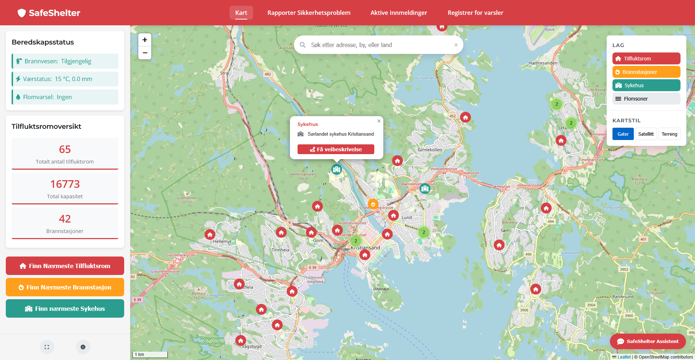
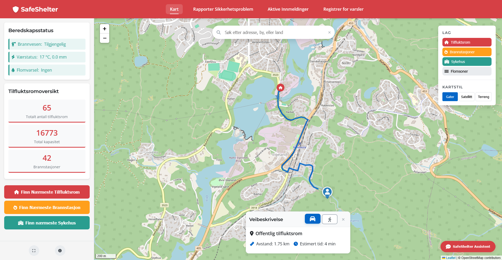
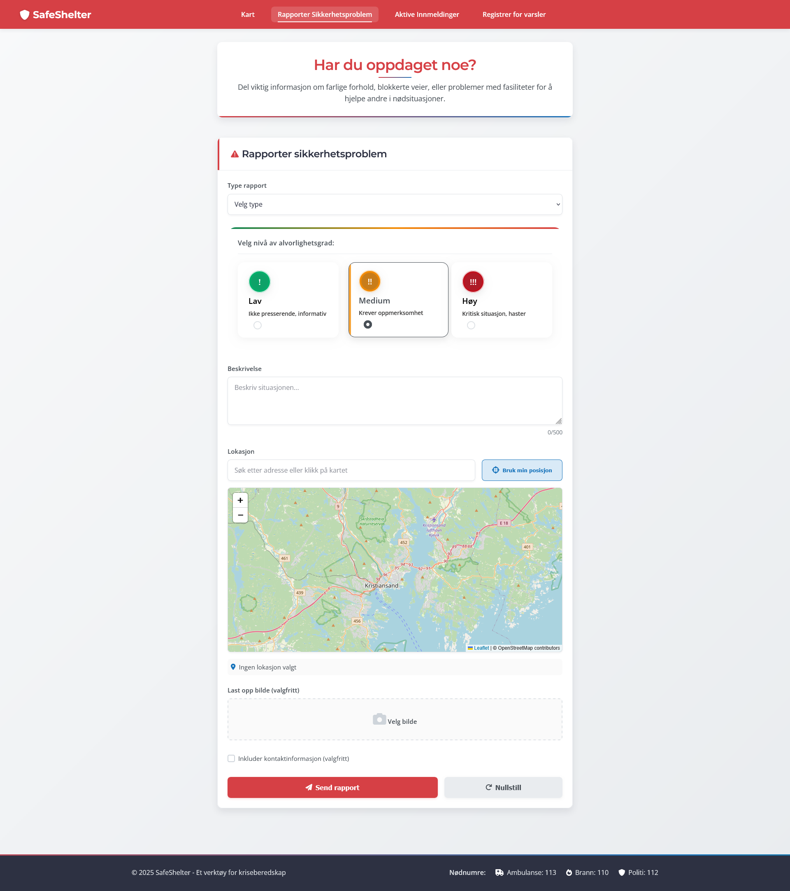
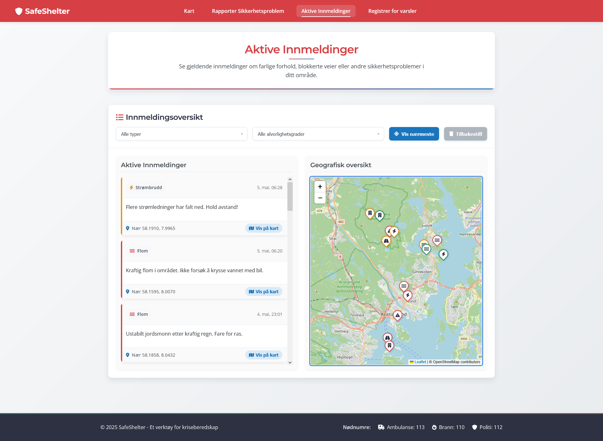

# SafeShelter - Gruppe 6

## Gruppemedlemmer:
- Sigurd Munk Brekke - sigurdmb@uia.no
- Daniel Davik Møgster - danieldm@uia.no
- Ole Bjørk Olsen - olebo@uia.no
- Emil Stokken Kaasa - emilsk@uia.no
- Sigurd Bøthun Mæland - sigurd.b.maland@uia.no
- Henrik Sæverud Lorentzen - henriksl@uia.no
<br></br>

## Prosjektbeskrivelse
**SafeShelter** er en fullstack geografisk beredskapsløsning som kombinerer sanntidsposisjonering med visualisering av tilfluktsrom, brannstasjoner, sykehus og flomutsatte områder. Systemet muliggjør rask identifisering av tryggeste ruter til nærmeste sikkerhetsfasiliteter under krisesituasjoner som flom, brann og naturkatastrofer, og representerer innovativ anvendelse av geografisk IT i samfunnssikkerhet.
<br></br>

## **Innholdsfortegnelse**

- [Oversikt og problemstilling](#oversikt-og-problemstilling)
- [Teknologivalg og Arkitektur](#teknologivalg-og-arkitektur)
- [Datakilder](#datakilder)
- [Backend/API-Implementasjon](#backendapi-implementasjon)
- [Frontend og Visualisering](#frontend-og-visualisering)
- [Hovedfunksjoner](#hovedfunksjoner)
- [Installasjon og Oppsett](#installasjon-og-oppsett)
- [Tekniske detaljer](#tekniske-detaljer)
- [Fremtidige Forbedringer](#fremtidige-forbedringer)
- [En Rask Oversikt Over Applikasjonen](#en-rask-oversikt-over-applikasjonen)

<br></br>

## **Oversikt og problemstilling**
Hvordan kan et geografisk informasjonssystem bruke sanntidsposisjon til å hjelpe brukeren med å finne nærmeste tilfluktsrom, brannstasjon eller sykehus, samt visualisere flomutsatte soner, slik at man raskt kan ta informerte beslutninger i kritiske situasjoner?

I Norge har flere områder varierende tilgang til offentlige tilfluktsrom, og i en nødsituasjon kan avstanden til nærmeste sikre sted være avgjørende for liv og helse. Derfor har vi utviklet dette verktøyet for å gi brukeren rask og presis informasjon om tryggeste rute til sikkerhet, samtidig som det kan gi svar på potensielt livsviktige spørsmål som hvordan man utfører hjerte-lunge redning.

Ved ekstreme værhendelser som storm, skogbrann og flom er det avgjørende at innbyggere raskt kan finne trygge tilfluktsrom og nødvendige nødetater. **SafeShelter** spiller en kritisk rolle i beredskapsarbeid ved å anvende sanntidsdata, GPS tracking og en personlig AI-assistent som kan hjelpe med alt mulig nødrelatert. 


<br></br>

## **Teknologivalg og Arkitektur**

- **Frontend:** 
  - Leaflet.js for kartvisualisering
  - HTML/CSS og JavaScript for brukergrensesnitt
  - OSRM (Open Source Routing Machine) for ruteberegninger
  - FontAwesome for kartmarkører og UI-ikoner
  - Leaflet WMS for håndtering av WMS-lag (NVE flomsoner)
  - Leaflet.markercluster for clustering av markører
  
- **Backend:** 
  - Node.js med Express.js for API-endepunkter
  - Supabase (PostgreSQL + PostGIS) for database og geospatiale spørringer
  
- **Databehandling:** 
  - QGIS for geospatial analyse og filkonvertering
  - Python-skript for rengjøring og transformasjon av datasett
  - Proj4js for koordinattransformasjoner i nettleseren
  - PostgreSQL (psql) + PostGIS for import, lagring og spørringer på geodata
  
- **Datakilder:** 
  - GeoNorge
  - NVE (Norges vassdrags- og energidirektorat) via WMS
  - OpenStreetMap (OSM) for basiskart og POI-data
  - Nominatim for geokoding

- **API**
  - OSRM API for ruteberegninger
  - OpenRouter API for AI-assistentfunksjonalitet
  - NVE WMS for flomdata
  - MET API for værdata

  <br></br>


## **Datakilder**

- **Datasett (alle filene er lagret i PostGIS-format i Supabase):**
    - [Brannstasjoner](https://kartkatalog.geonorge.no/metadata/brannstasjoner/0ccce81d-a72e-46ca-8bd9-57b362376485?search=Brannstasjoner)
    - [TilfluktsromOffentlige](https://kartkatalog.geonorge.no/metadata/tilfluktsrom-offentlige/dbae9aae-10e7-4b75-8d67-7f0e8828f3d8?search=Tilfluk)
 
    - [Flomsoner](https://kartkatalog.geonorge.no/metadata/flomsoner/e95008fc-0945-4d66-8bc9-e50ab3f50401) (WMS, NVE)

---

### **Databehandlingsprosess:**

Arbeidet med geodata foregikk i flere trinn:

1. **Datainnsamling:** Hentet data i PostGIS-format fra GeoNorge for tilfluktsrom og brannstasjoner.

2. **Forberedende behandling i QGIS:**
   - Filtrering av datasett for optimalisering
   - Transformasjon fra EUREF89/UTM32N (EPSG:25832) til WGS84 (EPSG:4326) for kartkompatibilitet
   - Attributtfiltrering for å beholde kun nødvendige felter som blant annet adresse, kapasitet og stasjonstype

3. **Transformasjon og optimalisering:**
   - Konvertering av geometry-datatyper
   - Tilrettelegging av data for effektiv henting via API-kall

4. **Koordinattransformasjon:**
   - Implementert Proj4js-bibliotek for håndtering av koordinattransformasjoner direkte i nettleseren
   - Dynamisk transformasjon mellom projeksjoner ved behov

<br></br>

## **Backend/API-Implementasjon**

Backend-en er implementert ved hjelp av Supabase som database, som gir enkel tilgang til tabeller og data. Express.js brukes for å håndtere API-forespørsler og fungere som en mellomtjeneste mellom frontend og Supabase.

### **Viktige API-endepunkter:**

| Endepunkt                   | Metode | Beskrivelse                                          |
| --------------------------- | ------ | -----------------------------------------------------|
| `/api/tilfluktsrom_agder`   | GET    | Henter tilfluktsromdata fra Supabase                 |
| `/api/brannstasjoner_agder` | GET    | Henter brannstasjonsdata fra Supabase                |
| `/api/weather`              | GET    | Henter værdata fra MET API (Meteorologisk institutt) |
| `/api/flood`                | GET    | Sjekker flomrisiko på en spesifikk lokasjon          |
| `/api/chat`                 | POST   | Sender brukerforespørsel til OpenRouter AI API       |


### **Eksterne API-tjenester som brukes:**

1. **OpenRouter API** - Brukes for AI-assistentfunksjonaliteten i chat.js
2. **MET API** (Meteorologisk institutt) - For værdata og -varsler
3. **NVE WMS** (Norges vassdrags- og energidirektorat) - For flomsonekartlag
4. **OSRM API** (Open Source Routing Machine) - For ruteberegning
5. **Overpass API** (OpenStreetMap) - For å hente sykehusdata

<br></br>

## **Frontend og Visualisering**

Frontend bruker Leaflet.js for interaktive kartvisualiseringer og HTML/CSS/JavaScript for grensesnitt og interaktivitet. Vi har implementert flere lag som kan aktiveres/deaktiveres, og et responsivt design som fungerer på tvers av enheter.

### **Visuelle funksjoner:**

- Dynamiske markører for tilfluktsrom og brannstasjoner
- Flere kartlag (gater, satellitt og terreng)
- Flomsoner via WMS-lag fra NVE
- Interaktive popups med informasjon
- Animerte rutevisualiseringer
- Markørklynger for bedre ytelse med mange datapunkter
- Applikasjonsomvisning
- Interaktivt kompass for kartnavigering og orientering
- Smidige sideoverganger med animasjoner mellom ulike sider
- Forbedrede animasjoner for innlasting av innmeldinger og rapporter
- Responsiv navigasjonsmeny
- Forbedret plassering og justering av UI-elementer for konsistent brukeropplevelse

<br></br>

## **Hovedfunksjoner**

### **1. Finn nærmeste tilfluktsrom**
- Tilfluktsrommets kapasitet og tilgjengelighet vises i popup-informasjon
- Brukerens posisjon hentes via nettleserens geolokalisering
- Avstand beregnes til alle tilfluktsrom med haversine-formel for luftlinjeavstand
- Nærmeste tilfluktsrom identifiseres basert på veiavstand
- Kjørerute beregnes ved hjelp av OSRM API med trafikkhensyn
- Flere transportmetoder tilgjengelig (kjøring og gange)
- Ruten vises på kartet med animert linjetegning for bedre visualisering
- Distanse og estimert ankomsttid vises i sanntid basert på valgt destinasjon og transportmetode

### **2. Finn nærmeste brannstasjon**
- Brukerens posisjon hentes via nettleserens geolokalisering
- Avstand beregnes til alle brannstasjoner med haversine-formel for luftlinjeavstand
- Nærmeste brannstasjon identifiseres basert på veiavstand
- Kjørerute beregnes ved hjelp av OSRM API med trafikkhensyn
- Flere transportmetoder tilgjengelig (kjøring og gange)
- Ruten vises på kartet med animert linjetegning for bedre visualisering
- Distanse og estimert ankomsttid vises i sanntid basert på valgt destinasjon og transportmetode


### **3. Finn nærmeste sykehus**
- Brukerens posisjon hentes via nettleserens geolokalisering
- Avstand beregnes til alle sykehus med haversine-formel for luftlinjeavstand
- Nærmeste sykehus identifiseres basert på veiavstand
- Kjørerute beregnes ved hjelp av OSRM API med trafikkhensyn
- Flere transportmetoder tilgjengelig (kjøring og gange)
- Ruten vises på kartet med animert linjetegning for bedre visualisering
- Distanse og estimert ankomsttid vises i sanntid basert på valgt destinasjon og transportmetode

### **4. Visning av flomsoner**
- Data hentes fra NVE WMS-tjeneste og vises dynamisk på kartet
- Brukeren kan aktivere/deaktivere flomsoner med en knapp
- Laget blir værende aktivt selv ved zooming ut/in for bedre oversikt
- Kartet gir informasjon om flomutsatte områder i sanntid
- Integrering med værvarsler for forventet nedbør og flomrisiko
- Varsler ved endringer i flomrisiko i brukerens valgte område

### **5. Kartsøk**
- Avansert adressesøk med autofullføring og prediksjon
- Resultater vises på kartet med tydelige markører
- Koordinattransformasjon fra ulike projeksjoner til WGS84

### **6. Informasjonspanel**
- Detaljert informasjon om valgt tilfluktsrom, brannstasjon eller sykehus
- Kapasitetsdata og addresse for tilfluktsrom
- Avdelingsinformasjon for brannstasjoner
- Interaktiv knapp for veibeskrivelse til valgt markør på kartet

### **7. AI Beredskapsassistent**
- Innebygd chatbot for beredskapsspørsmål og nødveiledning
- Svarer alltid på norsk (kan enkelt endres på)
- Gir rask tilgang til kritisk informasjon om evakuering og sikkerhet
- Prioriterer alltid relevante nødnumre først i krisesituasjoner
- Besvarer spørsmål om flom, tilfluktsrom, brannsikkerhet og førstehjelpstiltak
- Fungerer offline med et grunnleggende sett med beredskapsinformasjon
- Tilpasset norske beredskapsrutiner og planer
- Automatisk kontekstuell hjelp basert på brukerens handlinger i appen
- Opptrent med bred kunnskapsbase og kan hjelpe med det aller meste (ikke "hard-coded")

### **8. Sikkerhetsrapportering & Innmeldingsoversikt**
- Brukere kan melde inn sikkerhetsproblemer og faresituasjoner
- Kategorisering etter type fare (blokkert vei, flom, strømbrudd, osv.)
- Alvorlighetsgradsmerking (lav, medium, høy)
- Geografisk lokalisering av hendelser med kartstøtte
- Bildeopplasting for visuell dokumentasjon
- Mobiloptimalisert rapporteringsgrensesnitt
- Visuell representasjon av innmeldte saker i både kart og liste med detaljer og ikoner for brukervennlighet
- Varslinger til andre brukere i nærheten av rapporterte hendelser (dersom brukeren har registrert seg for å motta den type notifikasjoner)

### **9. Varselsregistrering**
- Brukere kan registrere seg for å motta lokasjonbaserte varsler
- Flere varslingsmetoder tilgjengelig (SMS, e-post, push-notifikasjoner)
- Få varslinger basert på et større areal, en hjemmeadresse eller GPS-basert
- GPS-baserte varslinger tilbyr sanntidsvarslinger mens man er ute på tur eller andre steder i landet
- Tilpassede varslingspreferanser for ulike hendelsestyper
- Personvernvennlige innstillinger med tydelig samtykkeforvaltning
- Mulighet for å velge spesifikke geografiske områder for varsler

### **10. Karttilpasninger**
- Bytte mellom ulike kartlag (gater, satellitt, terreng)
- Aktivere/deaktivere markørlag (tilfluktsrom, brannstasjoner, sykehus, flomsoner)
- Fullskjermsmodus for bedre oversikt i nødsituasjoner
- Logo-klikk for rask tilbakestilling av kartet eller for å gå tilbake til hjemmesiden
- Interaktivt kompass for orientering med retningsvisning (N, S, Ø, V, NØ, NV, SØ, SV)
- Tilpassede ikoner og symboler
- Zoom-nivåtilpasning med automatisk detaljnivåjustering
- Responsivt design


### **11. Analyse og visualisering av resultater**
- **Geografiske analyser:**
  - Nærmeste nabo-analyse for å identifisere korteste avstand til nødfasiliteter
  - Analyse via OSRM API for å beregne faktiske kjøreruter basert på veinettverk
  - Analyse for å identifisere sikkerhetsfasiliteter innenfor spesifikke avstander

- **Analyseresultater visualiseres gjennom:**
  - Ruter med optimal veivalg til nærmeste fasiliteter
  - Avstand og tidsestimater presentert direkte på kartet
  - Dynamisk klyngedannelse av markører for å illustrere tettheten av tilfluktsrom og brannstasjoner
  - Animerte innlastinger av rapporter og innmeldinger for forbedret brukeropplevelse
  - Smidige sideoverganger mellom ulike deler av applikasjonen

<br></br>


## **Installasjon og Oppsett**

1. **Forutsetninger:**
   ```
   npm version 6.x eller nyere
   Node.js version 14.x eller nyere
   ```

2. **Klon repositoriet:**
    ```bash
    git clone https://github.com/TriggeredBanana/gruppe6.git

    cd safeshelter
    ```

3. **Installer avhengigheter:**
   ```bash
   npm install
   ```

4. **Konfigurer miljøvariabler:**
   Opprett en .env-fil i rotmappen med følgende innhold:
   ```
   SUPABASE_URL= "https://din-supabase-url.supabase.co"
   SUPABASE_KEY= "din-supabase-nøkkel"
   OPENROUTER_API_KEY = "api-key-from-openrouter"
   ```

5. **Start serveren:**
   ```bash
   node server.js
   # or
   npm start
   ```

6. **Åpne applikasjonen:**
   Åpne index.html i en nettleser eller bruk en lokal server som Live Server i VS Code.

<br></br>

## **Tekniske detaljer**

### Kodestruktur:
| Filnavn | Beskrivelse |
|---------|------------|
| **mapoverlay.js** | Håndterer kartgrensesnitt, interaktivitet og geolokalisering |
| **script.js** | Hovedlogikk for datahåndtering og kartvisualisering |
| **ui.js** | Brukergrensesnitt, animasjoner, effekter og kontrollfunksjoner |
| **chat.js** | AI Beredskapsassistent - Integrerer med OpenRouter API for chatbot-funksjonalitet |
| **activeReports.js** | Håndtering og visualisering av brukerinnsendte sikkerhetsrapporter |
| **feedback.js** | Rapporteringsmodul som håndterer innsending av sikkerhetsrapporter |
| **register.js** | Implementerer en multi-stegs registreringsprosess med varselinnstillinger |
| **compass.js** | Implementerer interaktivt orienterings-kompass for kartnavigering |
| **server.js** | Backend API-endepunkter |
| **style.css, feedback.css, register.css, activeReports.css, chat.css** | Stilmaler som implementerer visuelle design for applikasjonen |
| **index.html, feedback.html, activeReports.html, register.html** | Hovedstrukturer for applikasjonen |

### Ruteberegning:
- `getRoadDistanceAndRoute()` i mapoverlay.js bruker OSRM API for å beregne faktiske kjøreruter
- Støtter flere transportmetoder (kjøring og gange)
- Beregner estimert ankomsttid basert på distanse og transportmetode
- Oppdaterer sanntidsestimater ved endringer i transportmetode
- Fallback til luftlinjeavstand hvis OSRM ikke er tilgjengelig

### Feilhåndtering og reserveløsninger:
- Geolokaliseringsfeil håndteres med brukervennlige meldinger som forklarer det spesifikke problemet
- Overgang til lokal beredskapsinformasjon når API er utilgjengelig
- Smidig håndtering av datafeil med informative meldinger til brukeren
- Progressiv forbedring som sikrer at kjernefunksjonalitet fungerer selv når avanserte funksjoner ikke er tilgjengelige


<br></br>

## **Fremtidige Forbedringer**

### **Planlagte oppdateringer:**
- Offline-modus med lokal datalagring for bruk i nødsituasjoner
- Forbedret håndtering av store datasett med avanserte klyngeteknikker
- Forbedret mobilresponsivitet for bruk i felt under nødsituasjoner
- Utvidede tilgjengelighetsalternativer for brukere med ulike behov

### **Tekniske forbedringer:**
- Implementasjon for live-oppdateringer
- Forbedring av rutealgoritmer med flere faktorer (trafikk, veiarbeid)

<br></br>

## **En Rask Oversikt Over Applikasjonen**

#### **Hovedgrensesnitt for SafeShelter**
Applikasjonen tilbyr et intuitivt grensesnitt med informasjon om tilfluktsrom, brannstasjoner, sykehus og utsatte flomsoner. Sidepanelet viser beredskapsstatus, nøkkelstatistikk om tilfluktsrom og hurtigknapper for å finne nærmeste tilfluktsrom, brannstasjon eller sykehus basert på brukerens posisjon. Det interaktive kartet viser plasseringen av tilfluktsrom (røde markører), brannstasjoner (oransje markører) og sykehus (grønne markører).
<details>
  <summary>📍 Klikk for å vise hovedgrensesnittet</summary>

  

</details>
<br></br>

#### **Omvisningsfunksjon**

Gjennom omvisningsfunksjonen kan nye brukere få en guidet omvisning av applikasjonens funksjoner. Omvisningen fremhever nøkkelelementer med en pulserende gul ramme, og gir trinnvis instruksjon om hvordan systemet brukes effektivt i nødsituasjoner. Brukere kan navigere gjennom hvert trinn eller hoppe over omvisningen helt. Omvisningen viser blant annet hvor brukeren kan trykke for å aktivere og deaktivere ulike kart-lag, samt bruke filtrering for å finne eller fjerne det de vil.
<details>
  <summary>📍 Klikk for å vise omvisningen</summary>

  
  

</details>
<br></br>

#### **Informasjonspanel for tilfluktsrom, brannstasjoner og sykehus**

Når en brannstasjon velges på kartet, vises detaljert informasjon i en pop-up over markøren. Dette inkluderer stasjonens avdeling og stasjonstype. Brukeren kan enkelt og greit få veibeskrivelse til valgt brannstasjon fra samme pop-up.
<details>
  <summary>📍 Klikk for å vise brannstasjonens informasjonsvisning</summary>

  
  
</details>
<br></br>
Velger man et tilfluktsrom vises kritisk informasjon som plassering, total kapasitet og tilgangsinstruksjoner (dersom noen er angitt av myndighetene). Brukeren kan enkelt og greit få veibeskrivelse til valgt tilfluktsrom fra samme pop-up.

<details>
  <summary>📍 Klikk for å vise tilfluktsromsinformasjon</summary>

  

</details>
<br></br>
Velger man et sykehus vises navnet på sykehuset. Brukeren kan enkelt og greit få veibeskrivelse til valgt sykehus fra samme pop-up.

<details>
  <summary>📍 Klikk for å vise tilfluktsromsinformasjon</summary>

  

</details>
<br></br>

#### **Søkefunksjonalitet**

Den smarte søkefunksjonen tilbyr adresseforslag mens du skriver, noe som gjør det enkelt å raskt finne spesifikke steder eller områder.
Etter å ha valgt et søkeresultat, sentreres kartet på plasseringen og viser en markør. Brukere kan deretter finne nærliggende tilfluktsrom eller utforske nærområdet.
<details>
  <summary>📍 Klikk for å vise søkefunksjonen</summary>

  
  

</details>
<br></br>

#### **Kartlag og visninger**

Satellittkartet gir detaljerte luftbilder, nyttig for å identifisere landemerker og navigere i områder hvor gatekart kan være utilstrekkelige.
<details>
  <summary>📍 Klikk for å vise satellittkart</summary>

  

</details>
<br></br>
Terrengvisningen fremhever topografiske elementer, som kan være særlig verdifullt ved vurdering av flomrisiko eller planlegging av evakueringsruter i fjellrike områder.

<details>
  <summary>📍 Klikk for å vise terrengkart</summary>

  

</details>
<br></br>

#### **Finn nærmeste tilfluktsrom, brannstasjon eller sykehus**

Brukere kan bruke "Finn Nærmeste Tilfluktsrom", "Finn Nærmeste Brannstasjon" eller "Finn Nærmeste Sykehus" for å finne nærmeste rute ved bruk av GPS. SafeShelter tar i bruk din nåværende posisjon, identifiserer det nærmeste beredskapsfasilitet og beregner den optimale ruten basert på valgt transportmåte. Systemet viser avstand og estimert reisetid for å hjelpe deg å nå tryggheten raskest mulig.

<details>
  <summary>📍 Klikk for å vise GPS-funksjonen for tilfluktsrom</summary>

  
  
  

</details>
<br></br>

#### **Flomsoner i Ulike Kartlag**

Brukere kan visualisere flomutsatte områder gjennom et dedikert flomsonelag, som kan aktiveres eller deaktiveres etter behov. Laget er integrert med NVE sin WMS-tjeneste og vises sømløst over de forskjellige karttypene. Ved å kombinere flomdata med gatekart, satellittbilder og terrengkart kan brukerne få en mer nyansert forståelse av risikoen i ulike områder. Dette hjelper både innbyggere og nødetater med å identifisere trygge evakueringsruter i tilfelle flom.

<details>
  <summary>📍 Klikk her for å vise flomsoner i forskjellige kartlag</summary>

  
  
  

</details>
<br></br>


#### **AI Beredskapsassistent**

SafeShelter inkluderer en intelligent chatbot-assistent som tilbyr umiddelbar hjelp om beredskap og nødsituasjoner. Assistenten svarer alltid på norsk, gir konkrete råd om evakueringsrutiner, førstehjelp og sikkerhetstiltak, og prioriterer alltid å vise relevante nødnumre i krisesituasjoner. Brukere kan når som helst åpne chatvinduet fra enhver side i applikasjonen.

<details>
  <summary>📍 Klikk for å vise AI assistenten</summary>

  
  

</details>
<br></br>

#### **Sikkerhetsrapportering**

Rapporteringsfunksjonen lar brukere melde inn sikkerhetsproblemer og faresituasjoner, som blokkerte veier, flomhendelser, strømbrudd eller andre farer. Rapporter kan kategoriseres etter type og alvorlighetsgrad, inkludere bilder og geografisk lokalisering. Enkle skjema med visuell tilbakemelding gjør prosessen brukervennlig selv i stressende situasjoner.

<details>
  <summary>📍 Klikk for å vise rapporteringsfunksjonen</summary>

  

</details>
<br></br>

#### **Innmeldingsoversikt for sikkerhetssituasjoner**

Innmeldingsoversikten visualiserer alle aktive sikkerhetsrapporter både på kart og i listeform, med mulighet for filtrering basert på type hendelse, alvorlighetsgrad og geografisk nærhet. Brukere kan raskt se detaljert informasjon om hver hendelse, inkludert beskrivelse, tidspunkt og lokasjon, og navigere direkte til stedet på kartet. Systemet gjør det også mulig å finne rapporter i nærheten av brukerens posisjon for umiddelbar situasjonsbevissthet.

<details>
  <summary>📍 Klikk for å vise innmeldingsoversikten</summary>

  

</details>
<br></br>

#### **Registrering for varsler**

Registreringsprosessen lar brukere sette opp personlige varslinger om sikkerhetshendelser. Brukere kan velge mellom flere varslingsmetoder (SMS, e-post, push-notifikasjoner), spesifisere hvilke typer hendelser de vil varsles om, og velge mellom ulike lokaliseringsmetoder (hjemmeadresse, geografisk område, eller GPS-basert). Den trinnvise prosessen gjør det enkelt å tilpasse varslene til personlige behov, samtidig som personvernhensyn ivaretas gjennom tydelige samtykkeinnstillinger.

<details>
  <summary>📍 Klikk for å vise registreringsprosessen for varsler</summary>

  
  
  
  
  
  

</details>
<br></br>

#### **Orienteringsverktøy med Kompass**

SafeShelter inkluderer et interaktivt kompass som viser himmelretninger (N, S, Ø, V, NØ, NV, SØ, SV) og hjelper brukere med å orientere seg på kartet. Kompasset er plassert nederst til venstre på kartet og kan brukes til å raskt tilbakestille kartets orientering ved å klikke på det.

<details>
  <summary>📍 Klikk for å vise kompass-funksjonen</summary>

  

</details>
<br></br>